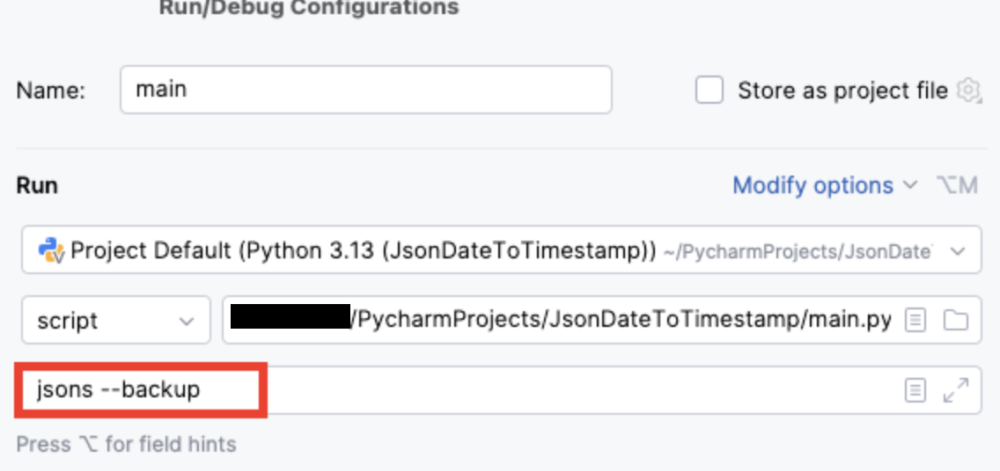

# Convertisseur de Dates JSON

Ce script permet de convertir les dates au format `YYYY-MM-DD HH:MM:SS` dans les fichiers JSON en timestamps Unix.

## Prérequis

- Python 3.x

## Installation

1. Clonez ce dépôt ou téléchargez les fichiers.
2. Assurez-vous d'avoir Python 3.x installé sur votre machine.

## Utilisation

#### Avec Pycharm
1.  Placez les fichiers JSON contenant les dates à convertir dans le dossier "jsons"
2. Lancer main.py, en éditant la configuration pour ajouter "jsons --backup" dans les parameters




#### En ligne de commande

1.  Placez les fichiers JSON contenant les dates à convertir dans le dossier "jsons"
2. Ouvrez un terminal.
3. Naviguez jusqu'au répertoire contenant le script `main.py`
4. Exécutez la commande suivante pour transformer tous les .jsons du dossier "jsons" en gardant une copie des fichiers originaux :

```bash
python main.py jsons --backup
```
Si vous ne voulez pas garder les jsons avant transformation :
```bash
python main.py jsons
```